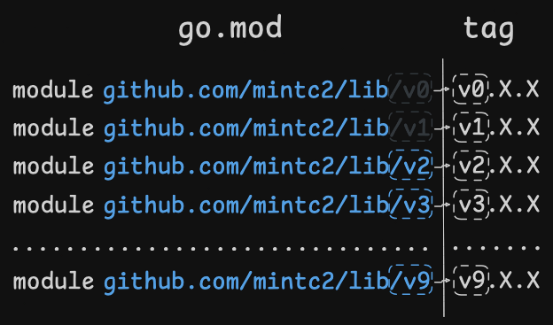

## Why does this article exist, Mint man?

One would think that semantic versioning is a simple enough concept that there would be nothing to talk about. "Major, minor, patch," and we're done.

But over the years of working with Go professionally and having the privilege of maintaining a couple of libraries, I've seen so many peculiar things, knowledge gaps, and misuses that by now I'm convinced that this topic has some depth to it and that it’s worth explaining in detail.

## What is Semantic Versioning?

I will use a slightly modified definition from the [Go docs](https://go.dev/doc/modules/version-numbers).

> "It's a versioning scheme where a module’s developer uses each part of a module’s version number to signal the version’s stability and backward compatibility. For each new release, a module’s release version number specifically reflects the nature of the module’s changes since the preceding release."


| Stage       | Version example | What bumping the stage means                                                                                                                                                                                                                                   |
| ----------- | --------------- | -------------------------------------------------------------------------------------------------------------------------------------------------------------------------------------------------------------------------------------------------------------- |
| Major       | v**1**.X.X      | Signals **backward-incompatible public API changes**. The "public API" is not only code declarations but also expectations for how the library behaves. This release carries no guarantee that it will be backward compatible with preceding major versions. |
| Minor       | vX.**1**.X      | Signals **backward-compatible public API changes**. This release guarantees backward compatibility and stability.                                                                                                                                              |
| Patch       | vX.X.**1**      | Signals **changes that don't affect the module's public API** or its dependencies. This release guarantees backward compatibility and stability.                                                                                                               |
| Pre-release | vX.X.X-**rc.1** | Signals that this is a **pre-release milestone, such as an alpha, beta, or release candidate**. This release carries no stability guarantees.                                                                                                                  |                                                                                          |

## How to decide which stage to bump

First, you just have to ask yourself a question, "If the clients were to pull this new version I'm about to publish, would they need to modify anything in the code or adjust their assumptions about how the library functions to be able to continue using it?" If the answer is "yes, they need to adjust," that's a breaking change that warrants a new major version.

Otherwise, it's a standoff between "minor" and "patch" versions. If you've added something new, it's a minor version bump. If you didn't add anything new, it's a patch version bump. In rare cases where you can't decide between those two, just bump the minor version.

## Special meaning behind v0.X.X

The major v0.X.X carries the special meaning of "this is a development version; backward compatibility is not guaranteed." What that means in practice is that it throws the whole semantic versioning out the window and you can even expect to get a breaking change between v0.0.0 and v0.0.1.

You probably shouldn't publish the library as v0 unless you specifically want to experiment with the API before you settle on something you can guarantee backward compatibility on going forward.

## Major Version Suffix Rule (MVSR) and v2.X.X

Now let's take a look at the semantic lord of confusion, the dreaded major version 2. If you simply try to publish the tag v2.0.0 and then fetch it, you will get this infamous error.

```sh
go: gitlab.com/mintc2/lib@v2.0.0: invalid version: go.mod has post-v2 module path "gitlab.com/mintc2/lib/v2" at revision v2.0.0
```

That's because any module with major version v2.X.X or more has to append the suffix `/v{major_version}` to the module name in the go.mod file and when importing it.

It's confusing and rightfully so:

* This rule has many names and none of them are short.
* It only affects major versions v2.X.X and above (for example, v3.X.X and v4.X.X).
* It has a "magical string" vibe to it.
* Most importantly, it messes with a mental model many developers have that "module name = Git repository path."



To make understanding easier, you can use this mental model instead. Imagine that v0.X.X and v1.X.X also have suffixes, but those suffixes are phantom ones. They are the OGs; they were there early, so they have the special privilege of being invisible, while all versions that come afterward do not get such special treatment.

## The many benefits of MVSR

As confusing as it is, the MVSR has a formidable list of things that make it good.

The first benefit is that the process of appending a suffix to the import path when fetching a new version and importing it into code makes accidental major version upgrades all but impossible. It has to be a conscious decision on the part of the library consumer.

The second thing is that you can have as many different major versions imported at the same time. At first glance, it doesn't seem like it would have any practical use, but it does. For example, if you have a Kafka wrapper library that defines publishers and consumers, you may decide that you only need to upgrade to the v4.X.X consumer while keeping the publisher on v3.X.X. This kind of flexibility is very valuable when you have deadlines to meet.

And the third thing is that the development of different major versions may continue in parallel, which, in combination with the point above, grants the developers even more flexibility.

## The zero-major dodge

Not everyone likes the MVSR. Some dislike it so much they resort to an unofficial trick—I’ll call it the “zero-major dodge.”

It works like this: the versioning scheme v**MAJOR**.**MINOR**.**PATCH** is shifted to v0.**MAJOR**.**PATCH**, sidestepping the need to append a **/vN** suffix to the module path.

And it’s a bad idea: it violates Go’s conventions, misleads users about stability, and can silently break consumers who don’t get the clear migration signal a proper /vN path provides. 

Don’t use this trick—it isn’t worth it.

## Tangential advice: mark previous major version as deprecated

> "Deprecation messages are intended to inform users that the module is no longer supported and to provide migration instructions, for example, to the latest major version. Individual minor and patch versions cannot be deprecated; retract may be more appropriate for that." (c) [Go docs](https://go.dev/ref/mod#go-mod-file-module-deprecation).

Suppose you have the latest tag at v1.5.2, but you've made a breaking change and now you need to publish v2.0.0. You no longer plan to maintain v1. Here's what you should do.

1. Create a new branch called "v1". Creating a new branch is preferred since then you'll have easy access to the older version if needed.
2. Add a deprecation message in go.mod. "Deprecated:" is case-sensitive.

```go title='go.mod'
// Deprecated: gitlab.com/mintc2/lib/v2 instead.
package gitlab.com/mintc2/lib
```

3. Commit and push the changes.
4. Create a new tag v1.5.3 (that's a required step, since info is pulled from @latest tag for that major version).
5. Switch away from v1 branch, implement v2 changes, append the suffix to the package name, commit and push the changes, create the tag v2.0.0.

The users of the v1 will see the deprecation warning and the suggestion to migrate to the v2 instead.

## Tangential advice: retract a version if it's "damaged" in some way

Have you published a library version and then, 5 minutes later, found out that you forgot to do something important and now that version is broken? Sounds like you could use a retraction.

> "When a module version is retracted, users will not upgrade to it automatically using **go get**, **go mod tidy**, or other commands. Builds that depend on retracted versions should continue to work, but users will be notified of retractions when they check for updates with go list -m -u or update a related module with go get." (c) [Go docs](https://go.dev/ref/mod#go-mod-file-retract)

So, say you just published version v1.5.0 and it should be retracted. Here's how you'd do it.

1. Add the retract directive to the go.mod.

```go title='go.mod'
package gitlab.com/mintc2/lib

retract(
    v1.5.0 // Published prematurely.
    v1.5.1 // Contains retractions only.
    // NOTE: Alternatively you can specify an inclusive interval like so
    // [v1.5.0, v1.5.1]
)
```

2. Commit and push the changes.
3. Release a new tag v1.5.1.

The retracted versions will not be automatically selected by the Go tooling. But explicitly fetching the retracted version would still be possible.

## Conclusion 

I hope this article has convinced you that following semantic versioning is a damn good idea and given you the knowledge to do so.

> Give a man a fish and he'll eat it. Give a man semantic versioning and he'll straight up start tagging it. And by, "it", haha, let's just say. His library. And it will be a sight to behold.